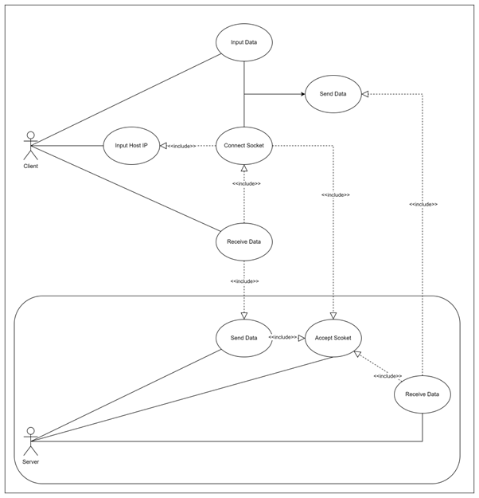
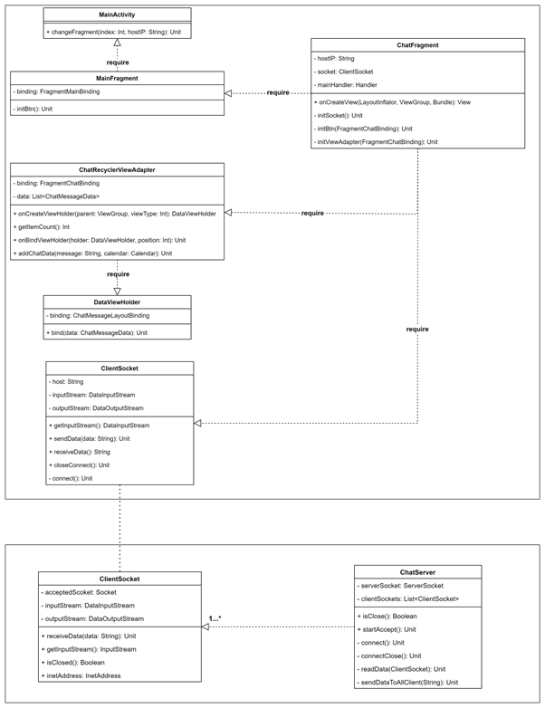
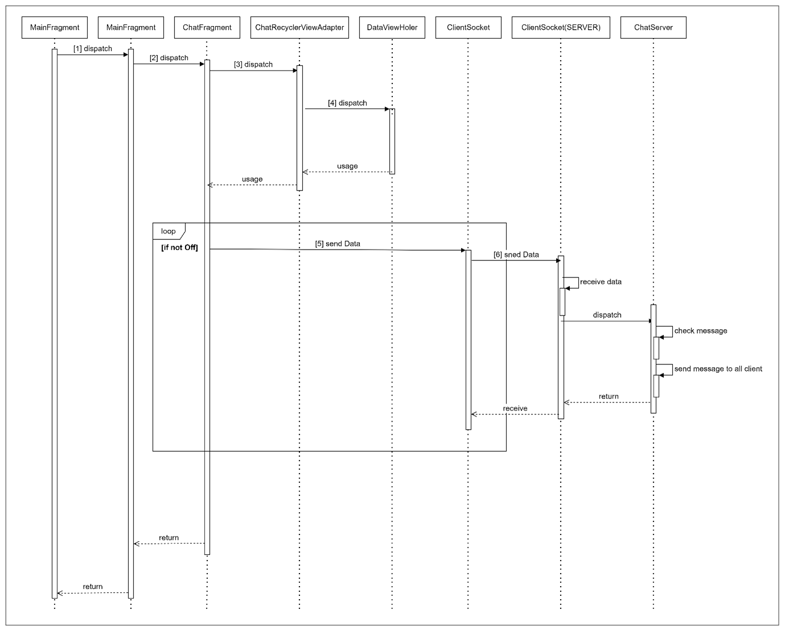

# 💻 Kotlin-SocketChat-Server
Socket을 이용한 kotlin server application

## 🛠 Specification
- intelliJ project
- kotlin version 17

## 📢 How to use
- intelliJ ide로 실행 후 Main.kt에서 Run
- port number 8082 사용
- cmd -> ipconfig명령어 사용하여 현재 사용 중인 ipv4 주소를 현재 사용 중인 host IP로 설정됨
```shell
server connect start!! port : 8082
ip : 0.0.0.0/0.0.0.0
lsa = 0.0.0.0/0.0.0.0:8082
<접속 성공 시 아래와 같이 출력됨>
client accept: /192.168.85.182
```

### ClientSocket.class
- client가 ServerSocket에 accept될 때마다 생성됨

### ChatServer.class
- client를 accept하고 client에게 전달 받은 data를 전체 client들에게 전송

### FileServer.class
- 기능구현 중
- client에게 파일 업로드/다운로드 기능을 제공

## 📜 USE CASE


## 📜 Class Diagram


## 📜 Sequence Diagram
